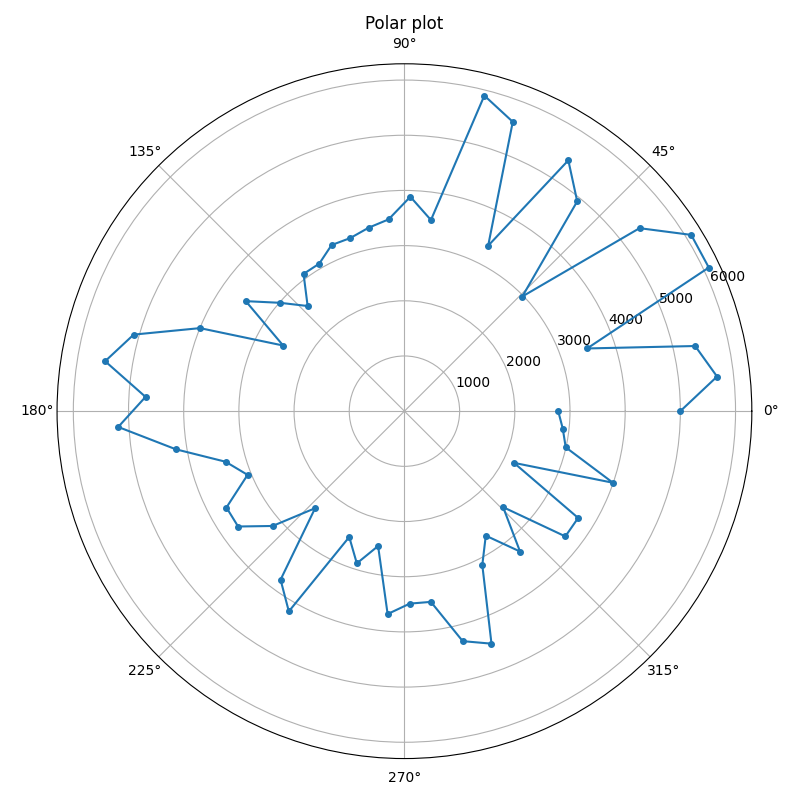

# Visualization repository

This file is meant to be a summary of all visualizations created, as well as their general use and location.

## Histogram 

Good to visualize continous values. Only that it requires visualization parameters (Bins)

Parameters are a pandas Series to split, number of bins, and ax to make the plot.

[**Code**](Visualization_repository.py#L24-L40)

## Grouped bars plot

Great way to show a small set of features from independent entities. Do not use if any of the bars is 0, better use a stacked bar plot. 

Parameters are a matrix where every row is a category, and column a subcategory. Pivot_table + aggfunc=Size will be useful. AQnd ax to plot.

[**Code**](Visualization_repository.py#L140-L171)

## Stacked bars plot

Great way to show a small set of features from independent entities. Do not use if all bars are > 0, better use a grouped bar plot. 

Parameters are a matrix where every row is a category, and column a subcategory. Pivot_table + aggfunc=Size will be useful. AQnd ax to plot.

[**Code**](Visualization_repository.py#L140-L171)

## Scatterplot visualization

Good to compare variable relationships.

Parameters are two independent x and y pandas Series to plot and an ax to make the visualization

[**Code**](Visualization_repository.py#L61-L73)

## Color Scatterplot visualization

Good to compare even more variable relationships. 

Parameters are three independent x,y and color variable pandas Series to plot and an ax to make the visualization

[**Code**](Visualization_repository.py#L76-L102)

## Bubble chart (Size Scatterplot) visualization

Good to compare even more variable relationships. 

Parameters are three independent x,y and size variable pandas Series to plot and an ax to make the visualization

[**Code**](Visualization_repository.py#L106-L136)

## Ordered Scatterplot visualization

Good to compare categorical with continous data. It solves the problem of very high, similar data visualized with histograms. 

Parameters are three independent x,y and color variable pandas Series to plot and an ax to make the visualization

[**Code**](Visualization_repository.py#L1061-L1110)

## Scatterplot Matrix visualization

Detailed way to display the relations between a bunch of variables. 

Parameters are a dataframe with continous values, where every column will be a variable. And a file path to be stored. 

[**Code**](Visualization_repository.py#L1208-L1242)

## Connected Scatterplot visualization

Compare the temporal relations between two variables

Parameters are a dataframe with 2 columns, first will be x second y. An ax to make the plot, and optionally a tuple to display label offset.

[**Code**](Visualization_repository.py#L1272-L1295)

## Heatmap plot

Great way to show a huge amount of data. It avoids overplotting with color/density information. 

Parameters are a matrix where every row is a category (Row of the heatmap), and column a subcategory (Column of the heatmap). Pivot_table + aggfunc=Size will be useful. AQnd ax to plot.

[**Code**](Visualization_repository.py#L208-L232)

## Polar Coordinate visualization

Good to compare data over cycles. 

Parameters are a pandas series to plot and the number of times to go around the axis

[**Code**](Visualization_repository.py#L43-L58)