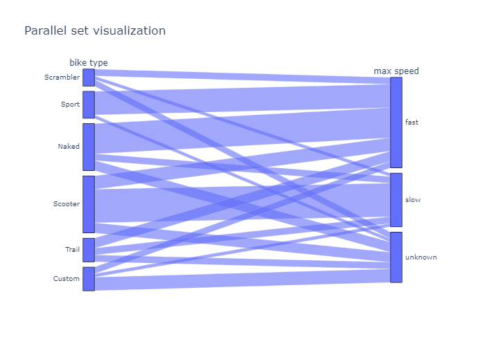
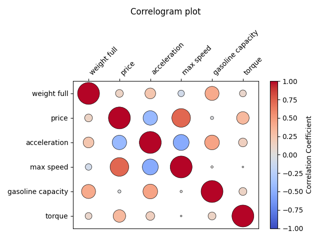
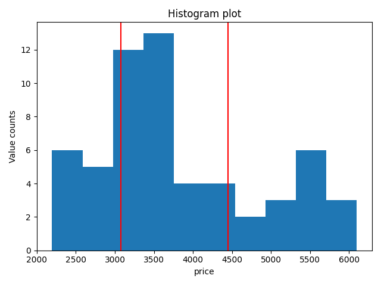
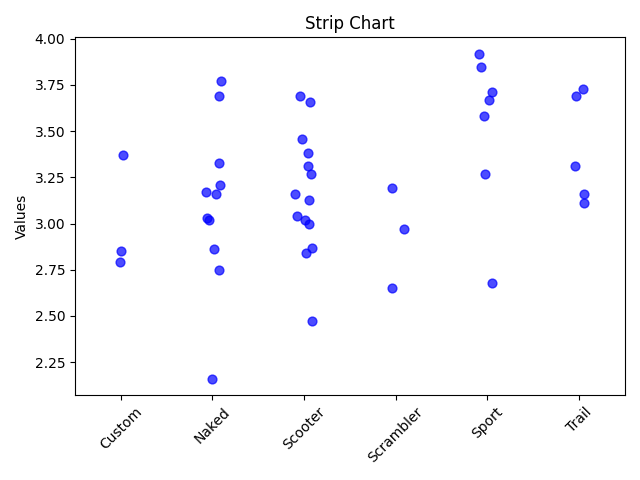
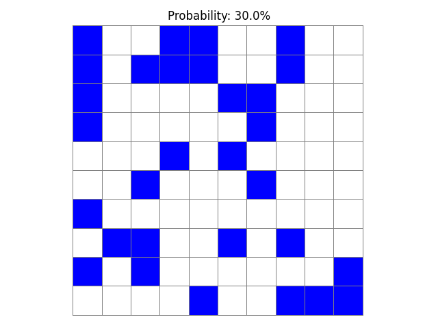
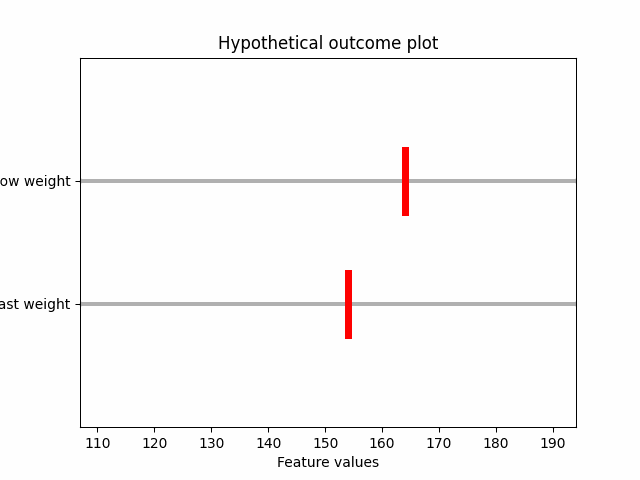

# Visualization repository

This file is meant to be a summary of all visualizations created, as well as their general use and location.

# ***General useful plots***

## Quantile-quantile plot

It can be used to assess wether or not data follows a certain distribution or not.  
It does not require any visualization parameters.

Parameters are a pandas series to plot and ax to make the plot in. 

[**Code**](Visualization_repository.py#L274-L301)

## Paralel set plot

Shows how categorical values divide into different groups 

Parameters are a pandas dataframe where every column must be a categorical variable and a file path to store the resulting visualization

[**Code**](Visualization_repository.py#L749-L771)

## Correlogram plot

Displays the correlations between variables in a intuitive way

Parameters are a dataframe with continous variables, where every column is a variable, and ax to make the plot in. 

[**Code**](Visualization_repository.py#L1166-L1215)

## Slopegraph plot

Displays the evolution of a variable depending on time or another categorical value

Parameters are a dataframe with continous values. Each column will be a stage in the slopegraph and ax to make the plot in 

[**Code**](Visualization_repository.py#L1256-L1279)

## Divide time series into components

Divides a time series in trend, seasonality and noise

Parameters a pandas series to decompose, and a file path to store the resulting visualization in 

[**Code**](Visualization_repository.py#L1309-L1347)

# ***Bar plots***
## Histogram 

Good to visualize continous values. Only that it requires visualization parameters (Bins)

Parameters are a pandas Series to split, number of bins, and ax to make the plot.

[**Code**](Visualization_repository.py#L24-L40)

## Grouped bars plot

Great way to show a small set of features from independent entities. Do not use if any of the bars is 0, better use a stacked bar plot. 

Parameters are a matrix where every row is a category, and column a subcategory. Pivot_table + aggfunc=Size will be useful. AQnd ax to plot.

[**Code**](Visualization_repository.py#L140-L171)

## Stacked bars plot

Great way to show a small set of features from independent entities. Do not use if all bars are > 0, better use a grouped bar plot. 

Parameters are a matrix where every row is a category, and column a subcategory. Pivot_table + aggfunc=Size will be useful. AQnd ax to plot.

[**Code**](Visualization_repository.py#L174-L205)

## Vertical plot

Provides details of specific amounts

Parameters are a pandas categorical series to plot. (Doesnt have to be category type) 

[**Code**](Visualization_repository.py#L623-L641)

## Horizontal plot

Provides details of specific amounts. Alternative to vertical when labels are a problem to visualize

Parameters are a pandas categorical series to plot. (Doesnt have to be category type) 

[**Code**](Visualization_repository.py#L644-L659)

## Single stacked bar plot

Provides details of specific amounts. Great alternative when one amount is 0. 

Parameters are a pandas categorical series to plot. (Doesnt have to be category type) 

[**Code**](Visualization_repository.py#L662-L699)

## Error bar plot

Provides details of specific amounts, while also displaying uncertainity in the variable.  

Parameters are a pandas continous series to plot and an ax to make the plot in 

[**Code**](Visualization_repository.py#L862-L881)

## Graded Error Bar plot

Provides details of specific distributions and quantiles, while also displaying uncertainity in the variable.  

Parameters are a pandas continous series to plot, an ax to make the plot in and ratio, a variable to control bar height 

[**Code**](Visualization_repository.py#L883-L935)

## Piechart plot

Compares the proportions of data

Parameters are a pandas categorical series to plot. (Doesnt have to be category type) 

[**Code**](Visualization_repository.py#L597-L617)

# ***Scatterplots***

## Scatterplot visualization

Good to compare variable relationships.

Parameters are two independent x and y pandas Series to plot and an ax to make the visualization

[**Code**](Visualization_repository.py#L61-L73)

## Color Scatterplot visualization

Good to compare even more variable relationships. 

Parameters are three independent x,y and color variable pandas Series to plot and an ax to make the visualization

[**Code**](Visualization_repository.py#L76-L102)

## Bubble chart (Size Scatterplot) visualization

Good to compare even more variable relationships. 

Parameters are three independent x,y and size variable pandas Series to plot and an ax to make the visualization

[**Code**](Visualization_repository.py#L106-L136)

## Ordered Scatterplot visualization

Good to compare categorical with continous data. It solves the problem of very high, similar data visualized with histograms. 

Parameters are three independent x,y and color variable pandas Series to plot and an ax to make the visualization

[**Code**](Visualization_repository.py#L1061-L1110)

## Scatterplot Matrix visualization

Detailed way to display the relations between a bunch of variables. 

Parameters are a dataframe with continous values, where every column will be a variable. And a file path to be stored. 

[**Code**](Visualization_repository.py#L1208-L1242)

## Connected Scatterplot visualization

Compare the temporal relations between two variables

Parameters are a dataframe with 2 columns, first will be x second y. An ax to make the plot, and optionally a tuple to display label offset.

[**Code**](Visualization_repository.py#L1272-L1295)

# ***Heatmaps***

## Heatmap plot

Great way to show a huge amount of data. It avoids overplotting with color/density information. 

Parameters are a matrix where every row is a category (Row of the heatmap), and column a subcategory (Column of the heatmap). Pivot_table + aggfunc=Size will be useful. AQnd ax to plot.

[**Code**](Visualization_repository.py#L208-L232)

## Ordered Heatmap

Great way to show a huge amount of data, with an ordered axis and the number of columns/intervals the data is goinng to be divided by. 

Parameters are a pandas series to plot and the number of times to go around the axis

[**Code**](Visualization_repository.py#L1112-L1151)

## Mosaic Plot

Shows how categorical values divide into different groups 

Parameters are a pandas dataframe where every column must be a categorical variable

[**Code**](Visualization_repository.py#L701-L722)

## Tree Map Plot

Shows how categorical values divide into different groups 

Parameters are a pandas dataframe where every column must be a categorical variable and file path to store the resultin image

[**Code**](Visualization_repository.py#L726-L7746)

# ***Density plots***

## Density plot

Great way to show information about a distribution as a whole. 

Parameters are a pandas series to plot and ax to make the plot in. 

[**Code**](Visualization_repository.py#L235-L246)

## Cumulative Density plot

Provides helpful, specific information about a distribution.  

Parameters are a pandas series to plot and ax to make the plot in. 

[**Code**](Visualization_repository.py#L248-L271)

## Box plot

Compares very specific details of distributions among one another.

Parameters are a pandas series or Series to plot and ax to make the plot in. Every column will be one distribution to plot. It can contain na that will be ignored, in case they are diferent sizes. 

[**Code**](Visualization_repository.py#L304-L335)

## Violin plot

Compares general distribution shapes against one another 

Parameters are a pandas series or Series to plot and ax to make the plot in. Every column will be one distribution to plot. It can contain na that will be ignored, in case they are diferent sizes. 

[**Code**](Visualization_repository.py#L338-L372)

## Strip chart

Compares Distribution with specific data points distribution. Works better with smaller amounts of data.

Parameters are a pandas series or Series to plot and ax to make the plot in. Every column will be one distribution to plot. It can contain na that will be ignored, in case they are diferent sizes.
There is the option to add jitter with jittering_strengh parameter. It measures how much points deviate from the vertical line that is its distributon. 

[**Code**](Visualization_repository.py#L374-L414)

## Sina plot

Combines Violin with stripchart. It implements by default density based jitter (More jitter the closer to the mean)

Parameters are a pandas series or Series to plot and ax to make the plot in. Every column will be one distribution to plot. It can contain na that will be ignored, in case they are diferent sizes. 

[**Code**](Visualization_repository.py#L417-L465)

## Overlapping density plot

Compares directly distributions one on top of the other

Parameters are a pandas series or Series to plot and ax to make the plot in. Every column will be one distribution to plot. It can contain na that will be ignored, in case they are diferent sizes. 

[**Code**](Visualization_repository.py#L468-L490)

## Density plot Comparison

Compares two segments of a distribution as a whole, providing insight of the differences between the data and their contributions to the whole

Parameters are a two pandas series or Series to plot and the two axes to plot them in. Flexibility adds margin to the x limits of the plot. 

[**Code**](Visualization_repository.py#L492-L548)

## Density Comparison Matrix

Presents the distribution of a continuos variable against two categorical, against the full distribution

Parameters are a dataframe with 3 cols, two first categorical, third continous, and a file path to store the resulting image 

[**Code**](Visualization_repository.py#L774-L832)

## Quantile Dot Plot

Provides a intuitive quantitative visualization of probability and the distribution

Parameters are a pandas series with continous variables, ax to make the plot, total number of dots to add in the figure, and number of columns.  

[**Code**](Visualization_repository.py#L937-L1008)

# ***Other case specific visualizations***
## Age pyramid plot

Divides a distribution by a variable. commonly used for age

Parameters are two pandas series or Series to plot an ax to make the plot in and the number of groups (divisions) to make on the y axis. 

[**Code**](Visualization_repository.py#L552-L597)

## Frequency plot

Provides a visual representation of a probability

Parameters are a probability (0-1), an ax to make the plot, and optionally the grid size of the plot.  

[**Code**](Visualization_repository.py#L835-L860)

## Hypothetical Outcome plot

Provides a visual representation of a probability using examples from the distribution.
When using it, make sure random selection get an accurate representation of the data. If 80% of one distribution is higher, have 5 figures with 4 being higher.

Parameters are two pandas series with continous values, the amount of pictures to show, and the file path to store the resulting image  

[**Code**](Visualization_repository.py#L1012-L1067)

